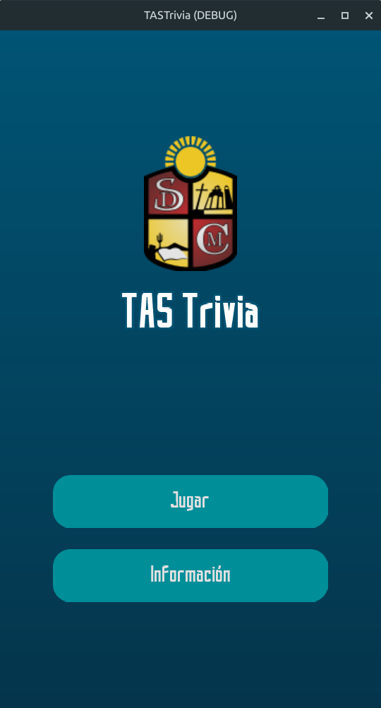
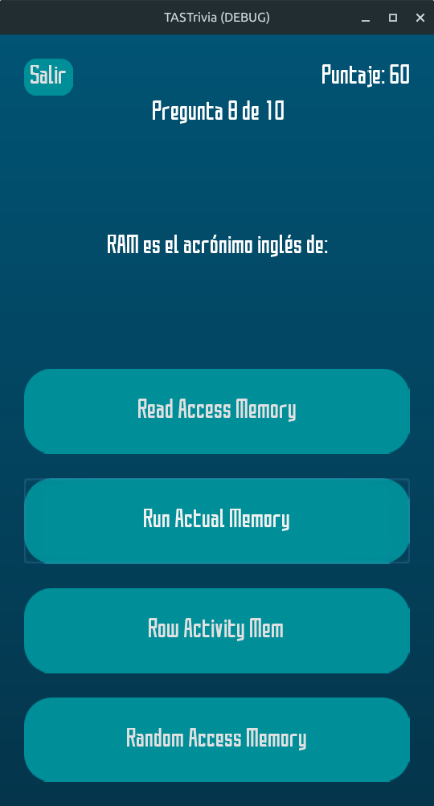

# TASTrivia

TASTrivia es un juego de tipo trivia creado con el motor Godot Engine.

Fue desarrollado para una exposición a cargo de alumnos de 1° año de la carrera "Tecnicatura Superior en Análisis de Sistemas" de la Sede Dinámica N.°6037-02, Coronel Moldes, Salta, en el año 2022.

**Autores:**

*   **Programador del Juego:** Ismael Alejandro Tolaba
*   **Autores de las Preguntas:** Fabiola Guerrero, Melina Chaile

**Motor Utilizado:**

*   Godot Engine v3.6

## Cómo Abrir y Ejecutar el Proyecto

Dado que no se proporcionan ejecutables precompilados, puedes ejecutar el juego directamente desde el editor de Godot Engine 3.x.

1. **Descarga Godot Engine 3.x:** Asegúrate de tener instalada una versión 3.x del Godot Engine (idealmente v3.6 o compatible). Puedes descargarla desde el sitio web oficial de Godot.
2. **Clona o Descarga el Proyecto:** Obtén una copia de este repositorio en tu máquina local.
3. **Abre el Proyecto en Godot:** Abre el Godot Engine y selecciona "Importar" o "Abrir Proyecto Existente". Navega hasta la carpeta raíz del proyecto `TASTrivia` que acabas de descargar y ábrela.
4. **Ejecuta la Escena Principal:** Una vez que el proyecto esté abierto en el editor de Godot, puedes ejecutar el juego directamente desde el editor presionando el botón de "Play" (o F5).
    * **Nota:** El juego fue diseñado principalmente para ser exportado a Android, pero su ventana de juego se adapta correctamente a las pantallas de plataformas de escritorio.

## Capturas de Pantalla

